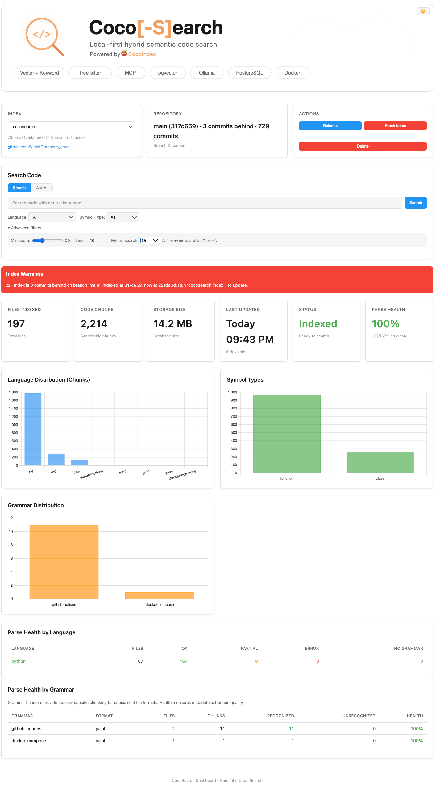
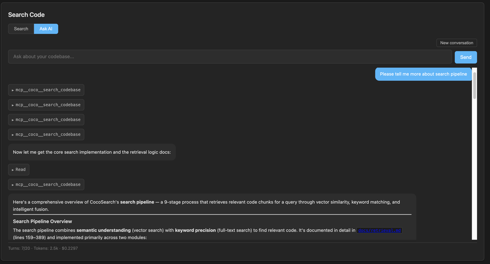
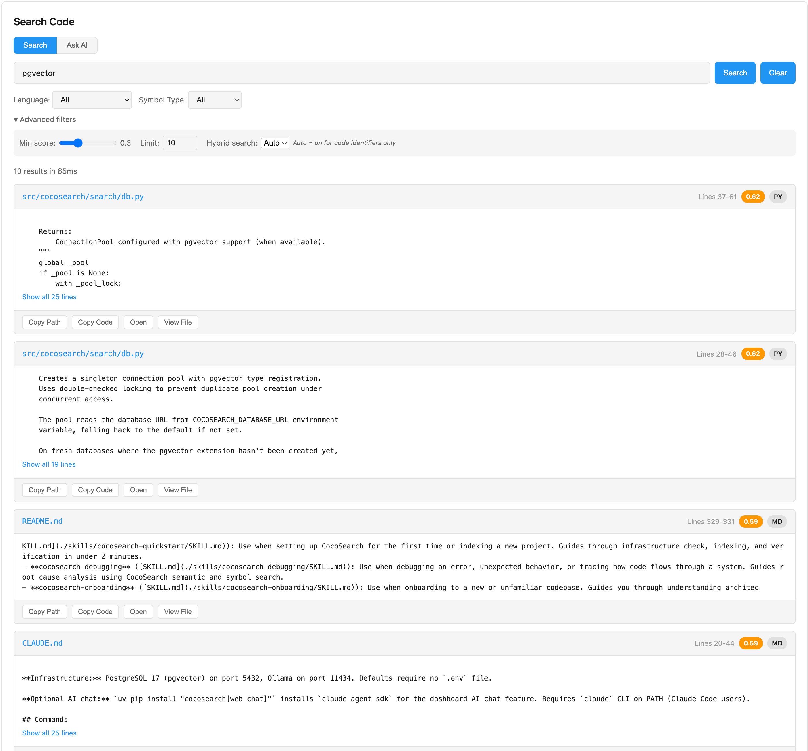

<p align="center">
  
</p>

<p align="center">
  <a href="https://pypi.org/project/cocosearch/"></a>
  <a href="https://www.python.org/">= 3.11"></a>
  <a href="LICENSE"></a>
  <a href="https://github.com/astral-sh/ruff"></a>
  <a href="https://github.com/astral-sh/uv"></a>
  <a href="https://docs.pytest.org/"></a>
  <a href="https://modelcontextprotocol.io/"></a>
</p>

<p align="center">
  <a href="#supported-languages"></a>
  <a href="#supported-languages"></a>
  <a href="#supported-languages"></a>
  <a href="#supported-languages"></a>
  <a href="#supported-languages"></a>
  <a href="#supported-languages"></a>
  <a href="#supported-languages"></a>
  <a href="#supported-languages"></a>
  <a href="#supported-languages"></a>
  <a href="#supported-languages"></a>
  <a href="#supported-languages"></a>
  <a href="#supported-languages"></a>
  <a href="#supported-languages"></a>
  <a href="#supported-languages"></a>
  <a href="#supported-languages"></a>
  <a href="#supported-languages"></a>
  <a href="#supported-languages"></a>
  <a href="#supported-languages"></a>
  <a href="#supported-languages"></a>
  <a href="#supported-languages"></a>
  <a href="#supported-languages"></a>
  <a href="#supported-languages"></a>
  <a href="#supported-languages"></a>
  <a href="#supported-languages"></a>
  <a href="#supported-languages"></a>
  <a href="#supported-languages"></a>
  <a href="#supported-languages"></a>
  <a href="#supported-languages"></a>
  <a href="#supported-languages"></a>
  <a href="#supported-languages"></a>
  <a href="#supported-languages"></a>
</p>

<p align="center">
  <a href="#supported-grammars"></a>
  <a href="#supported-grammars"></a>
  <a href="#supported-grammars"></a>
  <a href="#supported-grammars"></a>
  <a href="#supported-grammars"></a>
  <a href="#supported-grammars"></a>
  <a href="#supported-grammars"></a>
</p>

Coco[-S]earch is a local-first hybrid semantic code search tool. It combines vector similarity and keyword matching (via RRF fusion) to find code by meaning, not just text. Powered by [CocoIndex](https://github.com/cocoindex-io/cocoindex) for indexing, [Tree-sitter](https://tree-sitter.github.io/tree-sitter/) for syntax-aware chunking and symbol extraction, [PostgreSQL](https://www.postgresql.org/) with [pgvector](https://github.com/pgvector/pgvector) for storage, and [Ollama](https://ollama.com/) for local embeddings. No external APIs — everything runs on your machine.

Available as a WEB dashboard, CLI, MCP server, or interactive REPL. Incremental indexing, `.gitignore`-aware. Supports 31+ languages with symbol-level filtering for 14+, plus domain-specific grammars for structured config files.

## 📑 Table of Contents

- [⚠️ Disclaimer](#disclaimer)
- [✨ Features](#features)
- [🚀 Quick Start](#quick-start)
- [🐳 Running in Docker](#running-in-docker)
- [🖥️ Interfaces](#interfaces)
- [🏆 Where MCP Wins](#where-mcp-wins)
- [📚 Useful Documentation](#useful-documentation)
- [🧩 Components](#components)
  - [Available MCP Tools](#available-mcp-tools)
  - [Available Skills](#available-skills)
- [⚙️ How Search Works](#how-search-works)
- [🌐 Supported Languages](#supported-languages)
- [📝 Supported Grammars](#supported-grammars)
- [🔧 Configuration](#configuration)
- [🧪 Testing](#testing)
- [🛠️ Troubleshooting](#troubleshooting)

## Disclaimer

This project was originally built for personal use — a solo experiment in local-first, privacy-focused code search to accelerate self-onboarding to new codebases and explore spec-driven development. Initially scaffolded with [GSD](https://github.com/glittercowboy/get-shit-done) and refined by hand. Ships with a CLI, MCP tools, dashboards (TUI/WEB), a status API, reusable [Claude SKILLS](https://code.claude.com/docs/en/skills), and a [Claude Code plugin](https://code.claude.com/docs/en/plugins) for one-command setup.

## Features

- 💬 **Web AI Chat** -- ask questions about your codebase directly from the web dashboard via a `[Search] [Ask AI]` toggle. Powered by the [Claude Agent SDK](https://docs.claude.com/en/docs/agent-sdk/overview) — uses your existing Claude Code authentication, no extra API keys needed. The agent has access to semantic search, file reading, and grep. Chat responses render full markdown with syntax-highlighted code blocks, show tool invocations in collapsible panels, and display session stats (turns, tokens, cost). Optional: install with `uv tool install "cocosearch[web-chat]"` or run directly with `uvx "cocosearch[web-chat]" dashboard`.

- 🔍 **Hybrid search** -- combines semantic similarity (pgvector cosine) and keyword matching (PostgreSQL tsvector) via Reciprocal Rank Fusion. Auto-detects code identifiers (camelCase, snake_case, PascalCase) and enables hybrid mode automatically — or force it with `--hybrid`. Definition symbols (functions, classes) get a 2x score boost. RRF constant k=60.

- 🏷️ **Symbol filtering** -- narrow results to `function`, `class`, `method`, or `interface` with `--symbol-type`; match symbol names with glob patterns (`User*`, `*Handler`) via `--symbol-name`. Supported for 14 languages with Tree-sitter `.scm` queries. Filters apply before RRF fusion for better ranking quality.

- 📐 **Context expansion** -- results automatically expand to enclosing function/class boundaries using Tree-sitter AST traversal, so you see complete units of code instead of arbitrary line ranges. Supports Python, JavaScript, TypeScript, Go, Rust, and Scala. Hard-capped at 50 lines per result, centered on the match. Disable with `--no-smart` or set explicit line counts with `-B`/`-A`/`-C`.

- ⚡ **Query caching** -- two-level LRU cache (500 entries, 24h TTL): exact-match via SHA-256 hash of all search parameters, plus semantic fallback that finds paraphrased queries by cosine similarity (threshold 0.92, scanning last 50 entries). Cache auto-invalidates on reindex. Bypass with `--no-cache`.

- 🩺 **Parse health tracking** -- tracks per-file parse status across four categories: `ok`, `partial` (Tree-sitter produced a tree with ERROR nodes), `error` (parse failure), and `no_grammar`. Detects index staleness by comparing the indexed commit hash and branch against your current HEAD — the dashboard and CLI show warnings when the index drifts behind. View with `cocosearch stats --pretty`.

- 🔬 **Pipeline analysis** -- `cocosearch analyze` runs the search pipeline with full diagnostics: see identifier detection, mode selection, RRF fusion breakdown, definition boost effects, and per-stage timings. Available as CLI and MCP tool.

- 🔒 **Privacy-first** -- everything runs on your machine — Ollama generates embeddings locally, PostgreSQL stores vectors locally, no telemetry, no external API calls. Your code never leaves your machine. AI Chat is the only feature that calls an external API (Anthropic), and it's fully opt-in — requires a separate install (`cocosearch[web-chat]`).

<details>
<summary>Screenshots</summary>

<p align="center">
  
  &nbsp;&nbsp;
  
</p>

<p align="center">
  
  &nbsp;&nbsp;
  
</p>

</details>

## Quick Start

- **Services**:

```bash
# 1. Clone this repository and start infrastructure:
git clone https://github.com/VioletCranberry/coco-s.git && cd coco-s
# Docker volumes are bind-mounted to ./docker_data/ inside the repository,
# so infrastructure must be started from the cloned repo directory.
docker compose up -d
# 2. Verify services are ready.
uvx cocosearch config check
```

- **Indexing your projects**:

```bash
# 3.1 Use WEB Dashboard:
uvx cocosearch dashboard
# 3.2 Use CLI:
uvx cocosearch index .
# 3.3 Use AI and MCP - see below.
```

- **Register with your AI assistant (pick one)**:

**Option A — Plugin (recommended):**

```bash
claude plugin marketplace add VioletCranberry/coco-s
claude plugin install cocosearch@cocosearch
# All skills + MCP server configured automatically
```

**Option B — Manual MCP registration:**

```bash
claude mcp add --scope user cocosearch -- uvx cocosearch mcp --project-from-cwd
```

> **Note:** The MCP server automatically opens a web dashboard in your browser on a random port. Set `COCOSEARCH_DASHBOARD_PORT=8080` to pin it to a fixed port, or `COCOSEARCH_NO_DASHBOARD=1` to disable it.

- **AI Chat from the dashboard** (optional):

> **Note:** AI Chat is only available when running `cocosearch dashboard` directly. It is not available through the MCP server.

```bash
# Option A — run directly (no persistent install):
uvx "cocosearch[web-chat]" dashboard

# Option B — install persistently, then run:
uv tool install "cocosearch[web-chat]"
cocosearch dashboard

# Requires `claude` CLI on PATH (Claude Code users).
# Then open the dashboard and switch to the "Ask AI" tab.
```

## Running in Docker

Run CocoSearch as a centralized service — the host CLI forwards commands transparently over HTTP. The app container is opt-in via the `app` profile; `docker compose up` without it continues to start only PostgreSQL and Ollama, unchanged.

```bash
# Start the full stack (PostgreSQL + Ollama + CocoSearch app).
# PROJECTS_DIR sets which host directory is mounted as /projects inside the container.
PROJECTS_DIR=~/GIT docker compose --profile app up --build

# Point the host CLI at the running server (no local Postgres/Ollama needed).
# PATH_PREFIX rewrites host paths ↔ container paths in requests and results.
export COCOSEARCH_SERVER_URL=http://localhost:3000
export COCOSEARCH_PATH_PREFIX=~/GIT:/projects

cocosearch index ~/GIT/myapp
cocosearch search "authentication flow" -n myapp

# Web dashboard is available at the same URL
open http://localhost:3000/dashboard
```

## Interfaces

Search your code four ways — pick what fits your workflow:

| Interface            | Best for                                                                                                                                                          | How to start                        |
| -------------------- | ----------------------------------------------------------------------------------------------------------------------------------------------------------------- | ----------------------------------- |
| **CLI**              | One-off searches, scripting, CI                                                                                                                                   | `cocosearch search "auth flow"`     |
| **Interactive REPL** | Exploratory sessions — tweak filters, switch indexes, iterate on queries without restarting                                                                       | `cocosearch search --interactive`   |
| **Web Dashboard**    | Visual search + index management in the browser — filters, syntax-highlighted results, charts, dark/light theme                                                   | `cocosearch dashboard`              |
| **MCP Server**       | AI assistant integration ([Claude Code](https://claude.com/product/claude-code), [Claude Desktop](https://claude.com/download), [OpenCode](https://opencode.ai/)) | `cocosearch mcp --project-from-cwd` |

### CLI

```bash
# Index a project
uvx cocosearch index /path/to/project

# Search with natural language
uvx cocosearch search "authentication flow" --pretty

# Serve CocoSearch WEB dashboard
uvx cocosearch dashboard

# Analyze search pipeline (debug why results rank the way they do)
uvx cocosearch analyze "getUserById"

# Start interactive REPL
uvx cocosearch search --interactive

# View index stats with parse health
# Shows language/grammar distribution, symbol statistics, and parse health
uvx cocosearch stats --pretty

# View index stats with parse health live
uvx cocosearch stats --live

# List all indexes
uvx cocosearch list --pretty
```

For the full list of commands and flags, see [CLI Reference](./docs/cli-reference.md).

### Web Dashboard

`cocosearch dashboard` opens a browser UI at `http://localhost:8080` with:

- **Code search** — natural language queries with language, symbol type, and hybrid search filters. Results show syntax-highlighted snippets, score badges, match type, and symbol metadata.
- **Index management** — create, reindex (incremental or fresh), and delete indexes from the browser.
- **AI Chat** — integrated `[Search] [Ask AI]` pill toggle within the search section. Streaming responses with markdown rendering, syntax-highlighted code blocks (Prism.js), collapsible tool use display, and a stats bar showing turns, tokens, and cost. Requires `cocosearch[web-chat]` and `claude` CLI on PATH (Claude Code users only).
- **Observability** — language distribution charts, parse health breakdown, staleness warnings, storage metrics.

### Interactive REPL

`cocosearch search --interactive` starts a persistent search session:

```
cocosearch> authentication middleware
  [results...]
cocosearch> :lang python
  Language filter: python
cocosearch> error handling in views
  [results filtered to Python...]
cocosearch> :index other-project
  Switched to index: other-project
```

Settings persist across queries — change `:limit`, `:lang`, `:context`, or `:index` without restarting. Supports command history (up/down arrows) and inline filters (`lang:python` directly in queries).

## Where MCP wins

For codebases of meaningful size, CocoSearch reduces the number of MCP tool calls needed to find relevant code — often from 5-15 iterative grep/read cycles down to 1-2 semantic searches. This means fewer round-trips, less irrelevant content in the context window, and lower token consumption for exploratory and intent-based queries.

- **Exploratory/semantic queries**: "how does authentication work", "where is error handling done", "find the caching logic".
  - Native approach: Claude does 5-15 iterative grep/glob/read cycles, each adding results to context. Lots of trial-and-error, irrelevant matches, and full-file reads.
  - CocoSearch: 1 search_code call returns ranked, pre-chunked results with smart context expansion to function/class boundaries. Dramatically fewer tokens in context.
- **Identifier search with fuzzy intent**: "find the function that handles user signup".
  - Native grep requires Claude to guess the exact name (grep "signup", grep "register", grep "create_user"...). Each miss costs a round-trip + tokens.
  - CocoSearch's hybrid RRF (vector + keyword) handles this in 1 call.
- **Filtered searches**: language/symbol type/symbol name filtering is built-in. Native tools require Claude to manually assemble glob patterns and filter results.

## Useful Documentation

- [How It Works](./docs/how-it-works.md)
- [Architecture Overview](./docs/architecture.md)
- [Search Features](./docs/search-features.md)
- [Dogfooding](./docs/dogfooding.md)
- [MCP Configuration](./docs/mcp-configuration.md)
- [MCP Tools Reference](./docs/mcp-tools.md)
- [CLI Reference](./docs/cli-reference.md)
- [Retrieval Logic](./docs/retrieval.md)
- [Adding Languages](./docs/adding-languages.md)

## Components

- **Ollama** -- runs the embedding model (`nomic-embed-text`) locally.
- **PostgreSQL + pgvector** -- stores code chunks and their vector embeddings for similarity search.
- **CocoSearch** -- CLI and MCP server that coordinates indexing and search.

### Available MCP Tools

- `index_codebase` -- index a directory for semantic search
- `search_code` -- search indexed code with natural language queries
- `analyze_query` -- pipeline diagnostics: understand why a query returns specific results
- `list_indexes` -- list all available indexes
- `index_stats` -- get statistics and parse health for an index
- `clear_index` -- remove an index from the database

### Available Skills

- **cocosearch-quickstart** ([SKILL.md](./skills/cocosearch-quickstart/SKILL.md)): Use when setting up CocoSearch for the first time or indexing a new project. Guides through infrastructure check, indexing, and verification in under 2 minutes.
- **cocosearch-debugging** ([SKILL.md](./skills/cocosearch-debugging/SKILL.md)): Use when debugging an error, unexpected behavior, or tracing how code flows through a system. Guides root cause analysis using CocoSearch semantic and symbol search.
- **cocosearch-onboarding** ([SKILL.md](./skills/cocosearch-onboarding/SKILL.md)): Use when onboarding to a new or unfamiliar codebase. Guides you through understanding architecture, key modules, and code patterns step-by-step using CocoSearch.
- **cocosearch-refactoring** ([SKILL.md](./skills/cocosearch-refactoring/SKILL.md)): Use when planning a refactoring, extracting code into a new module, renaming across the codebase, or splitting a large file. Guides impact analysis and safe step-by-step execution using CocoSearch.
- **cocosearch-new-feature** ([SKILL.md](./skills/cocosearch-new-feature/SKILL.md)): Use when adding new functionality — a new command, endpoint, module, handler, or capability. Guides placement, pattern matching, and integration using CocoSearch.
- **cocosearch-explore** ([SKILL.md](./skills/cocosearch-explore/SKILL.md)): Use for codebase exploration — answering questions about how code works, tracing flows, or researching a topic. Autonomous mode for subagent/plan mode research; interactive mode for user-facing "how does X work?" explanations.
- **cocosearch-subway** ([SKILL.md](./skills/cocosearch-subway/SKILL.md)): Use when the user wants to visualize codebase structure as an interactive London Underground-style subway map. AI-generated visualization using CocoSearch tools for exploration.
- **cocosearch-add-language** ([SKILL.md](./skills/cocosearch-add-language/SKILL.md)): Use when adding support for a new programming language or config format. Guides through handlers, symbol extraction, and context expansion with registration checklists.
- **cocosearch-add-grammar** ([SKILL.md](./skills/cocosearch-add-grammar/SKILL.md)): Use when adding a grammar handler for domain-specific formats within a base language (e.g., GitHub Actions within YAML). Guides matches() design, separator spec, metadata extraction, and testing.

## How Search Works

```
 Query: "authentication flow"
 ─────────────────────────────────────────────────────────────────────
                              │
                    ┌─────────▼──────────┐
                    │   Query Analysis   │  Detect identifiers
                    │  (camelCase, etc.) │  → auto-enable hybrid
                    └─────────┬──────────┘
                              │
                    ┌─────────▼──────────┐
                    │  Ollama Embedding  │  nomic-embed-text
                    │   768-dim vector   │  (runs locally)
                    └─────────┬──────────┘
                              │
              ┌───────────────┴───────────────┐
              │                               │
    ┌─────────▼──────────┐          ┌─────────▼──────────┐
    │  Vector Similarity │          │  Keyword Search    │
    │  (pgvector cosine) │          │  (tsvector FTS)    │
    └─────────┬──────────┘          └─────────┬──────────┘
              │                               │
              └───────────┬───────────────────┘
                          │
                ┌─────────▼──────────┐
                │    RRF Fusion      │  Reciprocal Rank Fusion
                │  + Definition 2x   │  merges both ranked lists
                └─────────┬──────────┘
                          │
                ┌─────────▼──────────┐
                │  Symbol & Language  │  --symbol-type function
                │     Filtering       │  --language python
                └─────────┬──────────┘
                          │
                ┌─────────▼──────────┐
                │ Context Expansion  │  Expand to enclosing
                │ (Tree-sitter)      │  function/class boundaries
                └─────────┬──────────┘
                          │
                ┌─────────▼──────────┐
                │   Query Cache      │  Exact hash + semantic
                │   (LRU + 0.95)     │  similarity fallback
                └─────────┬──────────┘
                          │
                          ▼
                   Ranked Results
 ─────────────────────────────────────────────────────────────────────
```

## Supported Languages

CocoSearch indexes 31 programming languages. Symbol-aware languages support `--symbol-type` and `--symbol-name` filtering. Context-aware languages support smart expansion to function/class boundaries.

```
┏━━━━━━━━━━━━┳━━━━━━━━━━━━━━━━━━━━━━━━━━━━━┳━━━━━━━━━┳━━━━━━━━━┓
┃ Language   ┃ Extensions                  ┃ Symbols ┃ Context ┃
┡━━━━━━━━━━━━╇━━━━━━━━━━━━━━━━━━━━━━━━━━━━━╇━━━━━━━━━╇━━━━━━━━━┩
│ C          │ .c, .h                      │    ✓    │    ✗    │
│ C++        │ .cpp, .cc, .cxx, .hpp, .hxx │    ✓    │    ✗    │
│ C#         │ .cs                         │    ✗    │    ✗    │
│ CSS        │ .css, .scss                 │    ✓    │    ✗    │
│ DTD        │ .dtd                        │    ✗    │    ✗    │
│ Fortran    │ .f, .f90, .f95, .f03        │    ✗    │    ✗    │
│ Go         │ .go                         │    ✓    │    ✓    │
│ Groovy     │ .groovy, .gradle            │    ✗    │    ✗    │
│ HTML       │ .html, .htm                 │    ✗    │    ✗    │
│ Java       │ .java                       │    ✓    │    ✗    │
│ Javascript │ .js, .mjs, .cjs, .jsx       │    ✓    │    ✓    │
│ JSON       │ .json                       │    ✗    │    ✗    │
│ Kotlin     │ .kt, .kts                   │    ✗    │    ✗    │
│ Markdown   │ .md, .mdx                   │    ✗    │    ✗    │
│ Pascal     │ .pas, .dpr                  │    ✗    │    ✗    │
│ Php        │ .php                        │    ✓    │    ✗    │
│ Python     │ .py, .pyw, .pyi             │    ✓    │    ✓    │
│ R          │ .r, .R                      │    ✗    │    ✗    │
│ Ruby       │ .rb                         │    ✓    │    ✗    │
│ Rust       │ .rs                         │    ✓    │    ✓    │
│ Scala      │ .scala                      │    ✓    │    ✓    │
│ Solidity   │ .sol                        │    ✗    │    ✗    │
│ SQL        │ .sql                        │    ✗    │    ✗    │
│ Swift      │ .swift                      │    ✗    │    ✗    │
│ TOML       │ .toml                       │    ✗    │    ✗    │
│ Typescript │ .ts, .tsx, .mts, .cts       │    ✓    │    ✓    │
│ XML        │ .xml                        │    ✗    │    ✗    │
│ YAML       │ .yaml, .yml                 │    ✗    │    ✗    │
│ Bash       │ .sh, .bash, .zsh            │    ✓    │    ✗    │
│ Dockerfile │ Dockerfile                  │    ✗    │    ✗    │
│ HCL        │ .hcl                        │    ✓    │    ✓    │
└────────────┴─────────────────────────────┴─────────┴─────────┘
```

<details>
<summary>How chunking works</summary>

Chunking strategy depends on the language:

- **Tree-sitter chunking (~20 languages)**: CocoIndex's `SplitRecursively` uses Tree-sitter internally to split at syntax-aware boundaries (function/class edges). Covers Python, JavaScript, TypeScript, Go, Rust, Java, C, C++, C#, Ruby, PHP, and others in CocoIndex's [built-in list](https://cocoindex.io/docs/ops/functions#supported-languages).
- **Custom handler chunking (6 languages)**: HCL, Dockerfile, Bash, Go Template, Scala, and Groovy use regex-based `CustomLanguageSpec` separators tuned for their syntax — no Tree-sitter grammar available for these in CocoIndex.
- **Text fallback**: Languages not recognized by either tier (Markdown, JSON, YAML, TOML, etc.) are split on blank lines and whitespace boundaries.

In short: CocoIndex's Tree-sitter tells you _where to cut_; the `.scm` files tell you _what's inside each piece_.

Independently of chunking, CocoSearch runs its own Tree-sitter queries (`.scm` files in `src/cocosearch/indexer/queries/`) to extract symbol metadata — function, class, method, and interface names and signatures. This powers `--symbol-type` and `--symbol-name` filtering. Symbol extraction is available for 14 languages.

See [Adding Languages](./docs/adding-languages.md) for details on how these tiers work and how to add new languages or grammars.

</details>

## Supported Grammars

Beyond language-level support, CocoSearch recognizes **grammars** — domain-specific schemas within a base language. A **language** is matched by file extension (e.g., `.yaml` -> YAML, `.hcl` -> HCL), while a **grammar** is matched by file path and content patterns (e.g., `.github/workflows/ci.yml` containing `on:` + `jobs:` -> GitHub Actions, `*.tf` -> Terraform). Grammars provide structured chunking and richer metadata compared to generic text chunking.

```
┏━━━━━━━━━━━━━━━━┳━━━━━━━━━━━━━┳━━━━━━━━━━━━━━━━━━━━━━━━━━━━━━━━━━━━━━━━━━━━━━━━━━━━━━━━━━━━━━━━━━━━━━━━━━━━━━━━━━┓
┃ Grammar        ┃ File Format ┃ Path Patterns                                                                    ┃
┡━━━━━━━━━━━━━━━━╇━━━━━━━━━━━━━╇━━━━━━━━━━━━━━━━━━━━━━━━━━━━━━━━━━━━━━━━━━━━━━━━━━━━━━━━━━━━━━━━━━━━━━━━━━━━━━━━━━┩
│ docker-compose │ yaml        │ docker-compose*.yml, docker-compose*.yaml, compose*.yml, compose*.yaml           │
│ github-actions │ yaml        │ .github/workflows/*.yml, .github/workflows/*.yaml                                │
│ gitlab-ci      │ yaml        │ .gitlab-ci.yml                                                                   │
│ helm-template  │ gotmpl      │ **/templates/*.yaml, **/templates/**/*.yaml, **/templates/*.yml,                 │
│                │             │ **/templates/**/*.yml                                                            │
│ helm-values    │ yaml        │ **/values.yaml, **/values-*.yaml                                                 │
│ kubernetes     │ yaml        │ *.yaml, *.yml                                                                    │
│ terraform      │ hcl         │ **/*.tf, **/*.tfvars                                                             │
└────────────────┴─────────────┴──────────────────────────────────────────────────────────────────────────────────┘
```

<details>
<summary>How grammar matching works</summary>

Priority: Grammar match > Language match > TextHandler fallback.

A grammar is matched by file path patterns and optionally by content patterns. For example, a YAML file at `.github/workflows/ci.yml` containing `on:` + `jobs:` is recognized as GitHub Actions, not generic YAML. This enables structured chunking by job/step and richer metadata extraction (job names, service names, stages).

</details>

## Configuration

Create `cocosearch.yaml` in your project root to customize indexing:

```yaml
indexing:
  # See also https://cocoindex.io/docs/ops/functions#supported-languages
  include_patterns:
    - "*.py"
    - "*.js"
    - "*.ts"
    - "*.go"
    - "*.rs"
  exclude_patterns:
    - "*_test.go"
    - "*.min.js"
  chunk_size: 1000 # bytes
  chunk_overlap: 300 # bytes
```

## Testing

Tests use [pytest](https://docs.pytest.org/). All tests are unit tests, fully mocked, and require no infrastructure. Markers are auto-applied based on directory -- no need to add them manually.

```bash
uv run pytest                                          # Run all unit tests
uv run pytest tests/unit/search/test_cache.py -v       # Single file
uv run pytest -k "test_rrf_double_match" -v            # Single test by name
uv run pytest tests/unit/handlers/ -v                  # Handler tests
```

## Troubleshooting

**Dashboard shows "Indexing" but CLI shows "Indexed"**

The web dashboard and CLI now share a status sync mechanism: when the dashboard detects a live indexing thread, it corrects the database status so both interfaces agree. If you still see a discrepancy, check whether indexing is genuinely running (CPU usage, `docker stats` for Ollama activity).

**Index appears stuck in "Indexing" status**

After 1 hour with no progress updates, the status auto-recovers to "Indexed". You can also run `cocosearch index .` again to force a fresh index, which will reset the status.

**High CPU after indexing appears complete**

Ollama may still be processing embeddings in its queue. Check with `docker stats` or `ps aux | grep ollama`. CocoIndex may also perform background cleanup after the main indexing loop finishes.
